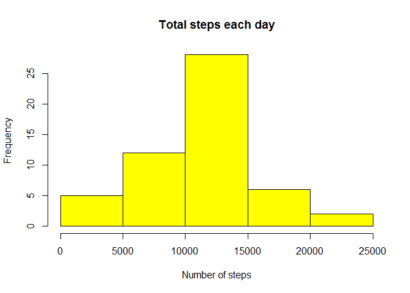
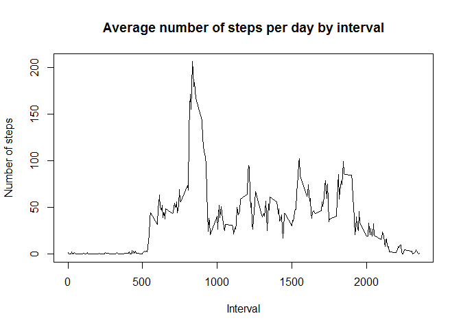
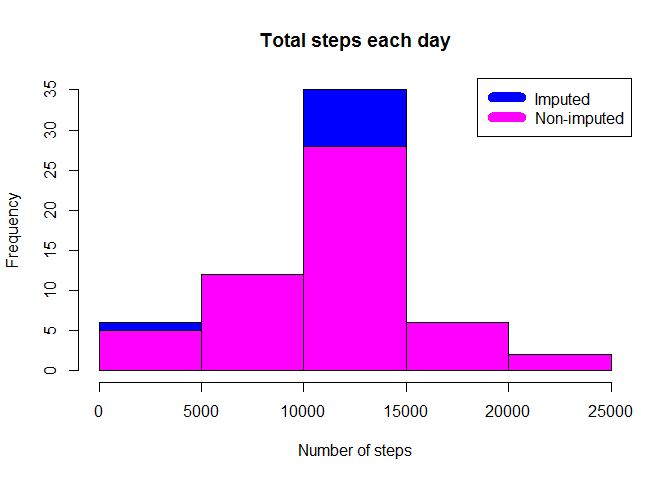
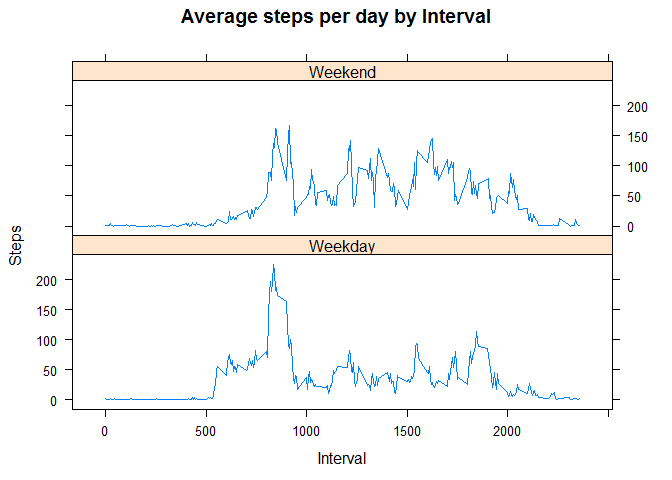

### About

The first project for the **Reproducible Research** course, part of the
Data Science specialization track offered by coursera.org. The project
answers a series of questions using data collected from a
[FitBit](http://en.wikipedia.org/wiki/Fitbit).

Synopsis
--------

This project involves the following activities:

-   Loading and preprocessing data
-   Imputing missing values
-   Interpreting data to answer research questions

Data
----

The data for this project can be downloaded from the course web site:

-   Dataset: [Activity monitoring
    data](https://d396qusza40orc.cloudfront.net/repdata%2Fdata%2Factivity.zip)
    \[52K\]

The variables included in this dataset are:

-   **steps**: Number of steps taking in a 5-minute interval (missing
    values are coded as `NA`)

-   **date**: The date on which the measurement was taken in YYYY-MM-DD
    format

-   **interval**: Identifier for the 5-minute interval in which
    measurement was taken

The dataset is stored in a comma-separated-value (CSV) file with a total
of 17,568 observations in this dataset.

Loading and preprocessing the data
----------------------------------

Download, unzip and load data into data frame `data`.

    if(!file.exists("getdata-projectfiles-UCI HAR Dataset.zip")) {
            temp <- tempfile()
            download.file("http://d396qusza40orc.cloudfront.net/repdata%2Fdata%2Factivity.zip",temp)
            unzip(temp)
            unlink(temp)
    }

    activity <- read.csv("activity.csv")
    activity_na_omitted <- na.omit(activity)
    total_activity_na_omitted <- aggregate(steps ~ date, activity_na_omitted, sum)

What is mean total number of steps taken per day?
-------------------------------------------------

Sum steps by day, create histogram, then calculate mean and median.

    steps_by_day <- aggregate(steps ~ date, total_activity_na_omitted, sum)
    hist(steps_by_day$steps, main = paste("Total steps each day"), col="yellow", xlab="Number of steps")

    rmean <- mean(steps_by_day$steps)
    rmedian <- median(steps_by_day$steps)

The `mean` is 1.076618910^{4} and the `median` is 10765.

What is the average daily activity pattern?
-------------------------------------------

-   Calculate average steps for each interval for all days.
-   Plot the Average Number Steps per Day by Interval.
-   Find interval with most average steps.

<!-- -->

    steps_by_interval <- aggregate(steps ~ interval, activity_na_omitted, mean)

    plot(steps_by_interval$interval,steps_by_interval$steps, type="l", xlab="Interval", ylab="Number of steps",main="Average number of steps per day by interval")

    max_interval <- steps_by_interval[which.max(steps_by_interval$steps),1]

The 5-minute interval, on average across all the days in the data set,
containing the maximum number of steps is 835.

Impute missing values. Compare imputed to non-imputed data.
-----------------------------------------------------------

Missing data needed to be imputed. Only a simple imputation approach was
required for this assignment. Missing values were imputed by inserting
the average for each interval. Thus, if interval 10 was missing on
10-02-2012, the average for that interval for all days (0.1320755),
replaced the NA.

    incomplete <- sum(!complete.cases(activity))
    imputed_data <- transform(activity, steps = ifelse(is.na(activity$steps), steps_by_interval$steps[match(activity$interval, steps_by_interval$interval)], activity$steps))

Zeroes were imputed for 10-01-2012 because it was the first day and
would have been over 9,000 steps higher than the following day, which
had only 126 steps. NAs then were assumed to be zeros to fit the rising
trend of the data.

    imputed_data[as.character(imputed_data$date) == "2012-10-01", 1] <- 0

Recount total steps by day and create histogram.

    steps_by_day_i <- aggregate(steps ~ date, imputed_data, sum)
    hist(steps_by_day_i$steps, main = paste("Total steps each day"), col="blue", xlab="Number of steps")

    #Create histogram to show difference. 
    hist(steps_by_day$steps, main = paste("Total steps each day"), col="magenta", xlab="Number of steps", add=T)
    legend("topright", c("Imputed", "Non-imputed"), col=c("blue", "magenta"), lwd=10)

Calculate new mean and median for imputed data.

    rmean.i <- mean(steps_by_day_i$steps)
    rmedian.i <- median(steps_by_day_i$steps)

Calculate difference between imputed and non-imputed data.

    mean_diff <- rmean.i - rmean
    med_diff <- rmedian.i - rmedian

Calculate total difference.

    total_diff <- sum(steps_by_day_i$steps) - sum(steps_by_day$steps)

-   The imputed data mean is 1.058969410^{4}
-   The imputed data median is 1.076618910^{4}
-   The difference between the non-imputed mean and imputed mean is
    -176.4948964
-   The difference between the non-imputed mean and imputed mean is
    1.1886792
-   The difference between total number of steps between imputed and
    non-imputed data is 7.536332110^{4}. Thus, there were
    7.536332110^{4} more steps in the imputed data.

Are there differences in activity patterns between weekdays and weekends?
-------------------------------------------------------------------------

Created a plot to compare and contrast number of steps between the week
and weekend. There is a higher peak earlier on weekdays, and more
overall activity on weekends.

    weekdays <- c("Monday", "Tuesday", "Wednesday", "Thursday", 
                  "Friday")
    imputed_data$dow = as.factor(ifelse(is.element(weekdays(as.Date(imputed_data$date)),weekdays), "Weekday", "Weekend"))

    steps_by_interval_i <- aggregate(steps ~ interval + dow, imputed_data, mean)

    library(lattice)

    xyplot(steps_by_interval_i$steps ~ steps_by_interval_i$interval|steps_by_interval_i$dow, main="Average steps per day by Interval",xlab="Interval", ylab="Steps",layout=c(1,2), type="l")

